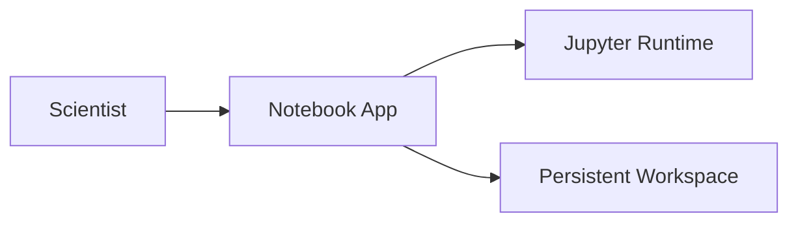

# Notebook App

> **A neon workbench for exploratory intelligence.** The Notebook App is the Backstage-facing application component for running Jupyter-based data science workflows inside the Teknoir platform.

## Identity

| Field | Value |
| --- | --- |
| Catalog name | `notebook-app` |
| Namespace | `teknoir` |
| Type | `app` |
| Lifecycle | `production` |
| Owner | `group:teknoir/public` |

## What it does

- Provides a ready Jupyter Notebook surface for experiments, analysis, and operational insight.
- Depends on the Notebook HelmChart for Kubernetes delivery.
- Runs on top of the Jupyter Data Science Stack image.

## Runtime vibe

## Launch notes

- Access is served through the chart's Notebook service on port `8888`.
- The current deployment disables the default Notebook token and XSRF check, so front-door access control should be handled by the surrounding platform.
- Workspace files are persisted through the mounted Notebook home directory.

## Best used for

- Fast data exploration.
- Edge-side diagnostics.
- Collaborative experiments that need the full Python data science stack close to Teknoir workloads.
